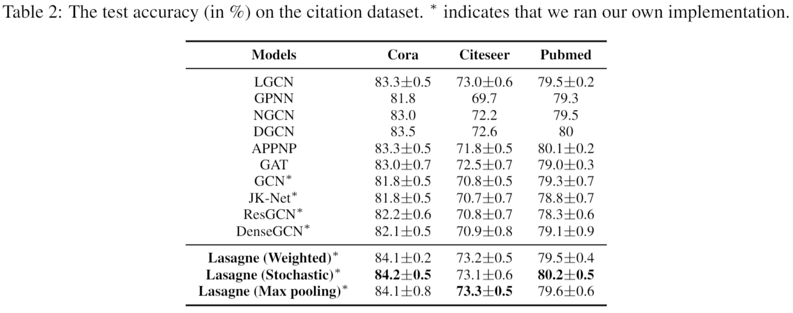

# Lasagne: A Multi-Layer Graph Convolutional Network Framework via Node-aware Deep Architecture.

This repository is the official implementation of Lasagne. 

## Requirements

To install requirements:

```setup
pip install -r requirements.txt
```


## Training

To train the model(s) in the paper:
- cd the examples dir.

- run the three ipynb notebook files (e.g. “Lasagne-maxpool-6layers.ipynb”)


## Results

Performance of Lasagne on transductive settings:

